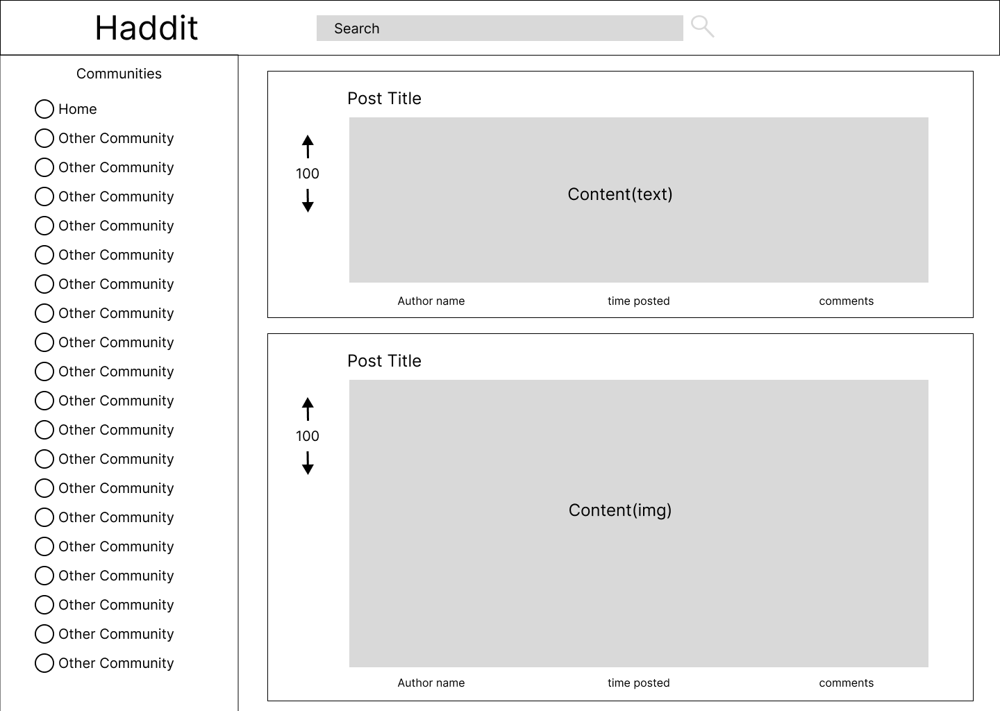

# Spotify Saver

## Description

Habbit is a web application that displays positive communities from Reddit's JSON API. It is built using Figma for wireframing, HTML, CSS, Javascript, React, Redux, Jest, and Vite.

## WireFrame

Created with Figma:

## Stack Used

- Figma
- HTML
- CSS
- JavaScript
- React
- Redux
- Jest
- Vite

## Features

- Display positive communities from Reddit's JSON API
- Only show communities with positive themes such as r/happy and r/upliftingnews
- Clean and user-friendly interface
- Responsive design for mobile and desktop devices
- Uses Redux for state management
- Utilizes Jest for testing
- Built with Vite for fast development and hot module replacement

## Getting Started

Currently this site is only in development and cannot be used. Please wait for the first milestone to be released.

## MIT License

Copyright (c) [2023] [James Randall III]

Permission is hereby granted, free of charge, to any person obtaining a copy
of this software and associated documentation files (the "Software"), to deal
in the Software without restriction, including without limitation the rights
to use, copy, modify, merge, publish, distribute, sublicense, and/or sell
copies of the Software, and to permit persons to whom the Software is
furnished to do so, subject to the following conditions:

The above copyright notice and this permission notice shall be included in all
copies or substantial portions of the Software.

THE SOFTWARE IS PROVIDED "AS IS", WITHOUT WARRANTY OF ANY KIND, EXPRESS OR
IMPLIED, INCLUDING BUT NOT LIMITED TO THE WARRANTIES OF MERCHANTABILITY,
FITNESS FOR A PARTICULAR PURPOSE AND NONINFRINGEMENT. IN NO EVENT SHALL THE
AUTHORS OR COPYRIGHT HOLDERS BE LIABLE FOR ANY CLAIM, DAMAGES OR OTHER
LIABILITY, WHETHER IN AN ACTION OF CONTRACT, TORT OR OTHERWISE, ARISING FROM,
OUT OF OR IN CONNECTION WITH THE SOFTWARE OR THE USE OR OTHER DEALINGS IN THE
SOFTWARE.
